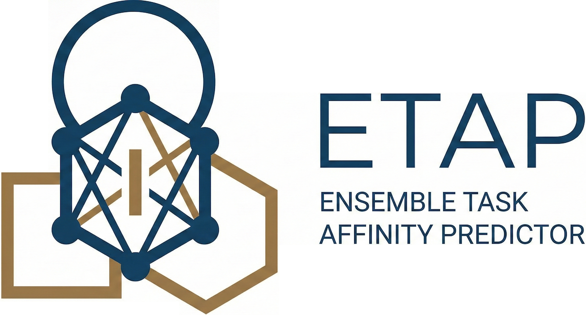

This repository contains the code and data for the paper [“Ensemble Prediction of Task Affinity for Efficient Multi-Task Learning”](https://openreview.net/forum?id=RuVT3PeX1M), published at the [14th International Conference on Learning Representations (ICLR 2026)](https://iclr.cc/Conferences/2026).

**arXiv version:** [https://arxiv.org/abs/2602.18591](https://arxiv.org/abs/2602.18591)

# Ensemble Prediction of Task Affinity for Efficient Multi-Task Learning

A fundamental problem in multi-task learning (MTL) is identifying groups of tasks that should be learned together. Since training MTL models for all possible combinations of tasks is prohibitively expensive for large task sets, a crucial component of efficient and effective task grouping is predicting whether a group of tasks would benefit from learning together, measured as per-task performance gain over single-task learning. In this paper, we propose **ETAP** (Ensemble Task Affinity Predictor), a scalable framework that integrates principled and data-driven estimators to predict MTL performance gains. First, we consider the gradient-based updates of shared parameters in an MTL model to measure the affinity between a pair of tasks as the similarity between the parameter updates based on these tasks. This linear estimator, which we call affinity score, naturally extends to estimating affinity within a group of tasks. Second, to refine these estimates, we train predictors that apply non-linear transformations and correct residual errors, capturing complex and non-linear task relationships. We train these predictors on a limited number of task groups for which we obtain ground-truth gain values via multi-task learning for each group. We demonstrate on benchmark datasets that ETAP improves MTL gain prediction and enables more effective task grouping, outperforming state-of-the-art baselines across diverse application domains.

